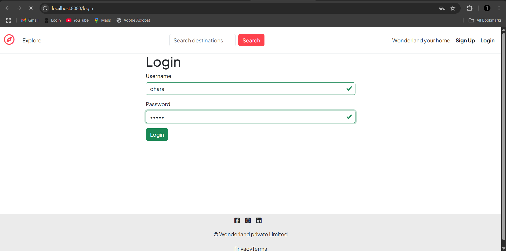
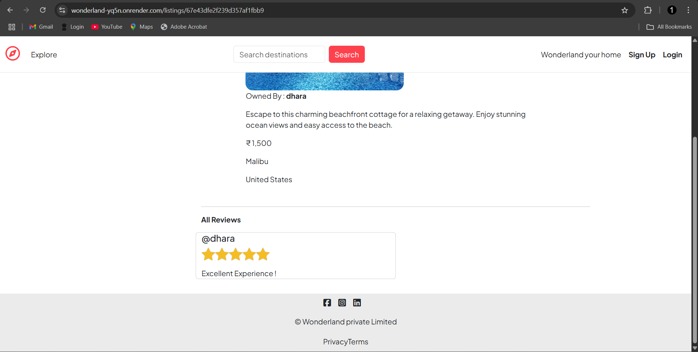

# Wonderland

Welcome to **Wonderland**, a project designed to property booking and listing with a user-friendly design. Built for efficiency, accessibility, and a smooth user experience.

## Features
- User authentication (Sign In & Login)
- Add, update, and delete listings (Only the owner of the listing can edit or delete it)
- Show listing details
- Review system (Users can add reviews only after logging in, and only the review author can delete their review)
- Implements MVC (Model-View-Controller) structure

## Technologies Used
- **Frontend:** HTML, CSS, JavaScript, EJS
- **Backend:** Node.js, Express.js
- **Database:** MongoDB
- **Validation:** Joi (e.g., `comment: Joi.string().required()`, used for comments)

## Installation
1. Clone the repository:
   ```sh
   git clone https://github.com/yourusername/wonderland.git
   ```
2. Navigate to the project directory:
   ```sh
   cd wonderland
   ```
3. Install dependencies:
   ```sh
   npm install
   ```
4. Set up environment variables (`.env` file)
   ```env
   PORT=5000
   MONGODB_URI=your_database_url
   ```
5. Start the server:
   ```sh
   npm start
   ```

## Contribution
Feel free to contribute! Submit a pull request or open an issue if you find any bugs or have feature suggestions.

## Screenshots

### SignIn page


### Login Page


### HomePage Before login


### Homepage After login


### Add_Listing page


### Show_Listing page


### Review feature


### Update page


Happy Coding! 🎉

